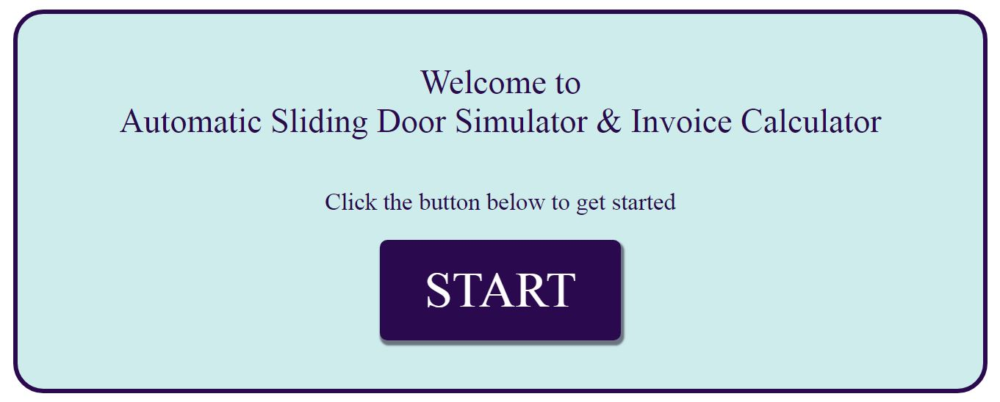
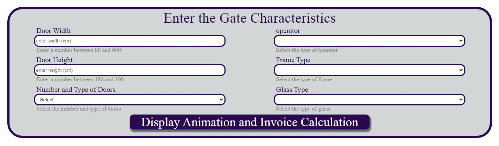
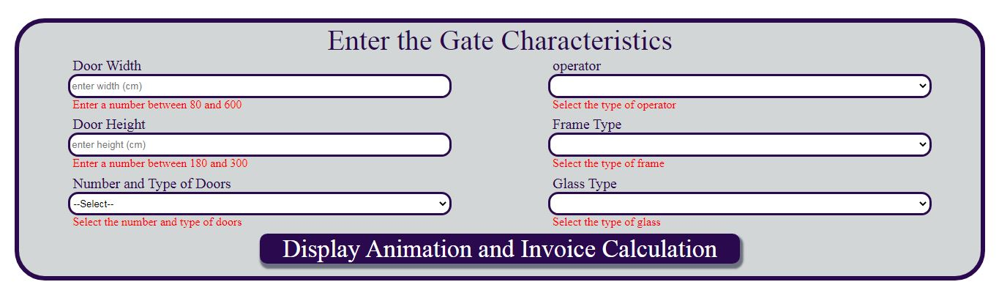
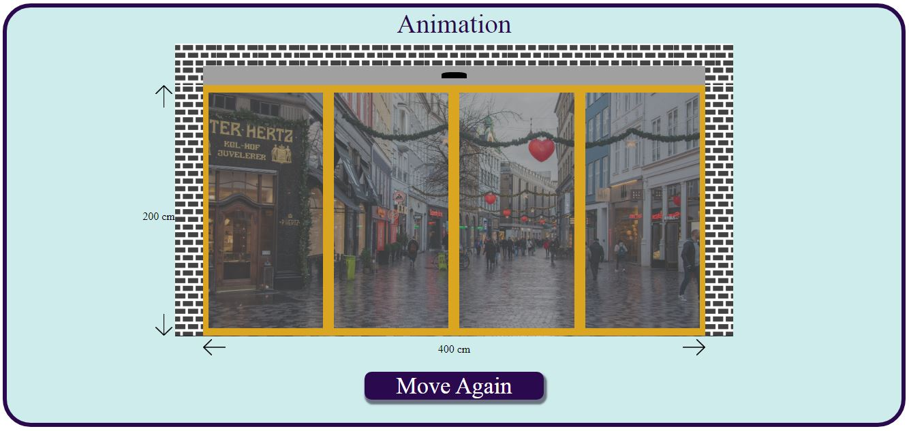
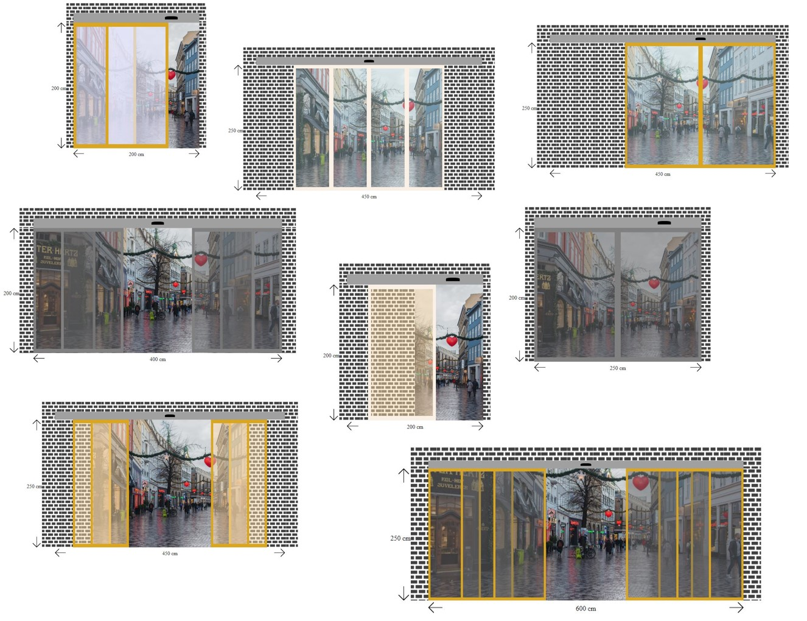

# Automatic Sliding Door Application

This project is an Automatic Sliding Door Application to simulation and calculate prices.

I utilized some technologies like HTML, CSS, JavaScript and Angular.js

This video shows performance of application:

# Starting page

# Getting door characteristics

User can chose dimensions, type, automatic operator brand, frame color and glass color.

# Validation

If user drop a part or the dimensions be out of range , the hint text color will change to red.

# Showing animation and invoice

If the characteristics are approved, animation box and invoice box will show.

At first, animation plays automatically, then user can play again by pushing "move again" button.
Furthermore, user can change characteristics and see differences.

<h3>Animation:</h3>

<h2>Invoice:</h2>

<h2>Examples of different characteristics:</h2>

